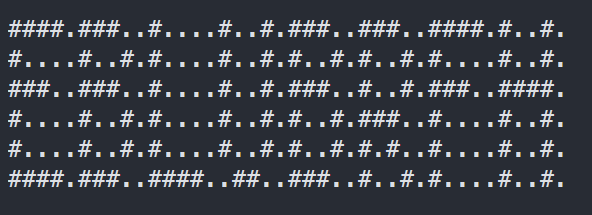

# Advent of Code 2021

My first time participating in [Advent of code](https://adventofcode.com/2021).

This repo contains the code for all the days I ~~completed~~ attempted. This README contains a few quick notes for specific days.

## Day 1
- Felt good about getting my first two gold stars
- I did brute-force solution first, before learning about the neat trick (described below)
- zip can be a nice way to combine a list with itself offset by a few elements
- True is truthy and evals to 1 when used in a sum or other numirical calculation
- don't need the brackets for a list comprehension when used in sum (forgot why)
- nice trick that you don't need to do an actual summation of the window since it's a sliding window and two
elements in the window stay constant, therefore we are really comparing the first and fourth elements in Part B - knowing that simplifies the code 

## Day 2
- pretty straightforward
- came up with a short, clean solution
- could have used an if-elif block (or the new switch statement in 3.10, which I wasn't yet using), but instead just went with a function dictionary

## Day 3
- learned about the [Advent-of-code-data](https://github.com/wimglenn/advent-of-code-data) library which makes it easier to load your puzzle input, so switched to using this instead
- I think this is pretty clean. I really want to stick with vanilla python on these, so not using numpy or pandas

## Day 4
- basic BINGO implementation
- using OOP in python is fun - Board class does most of the work

## Day 5
- working with grids is fun
- cool to see how many people visualize these puzzles (maybe next year, I'll try that)
- solution is a little cluncky, but it works

## Day 6
- Struggled a bit on this one. Got a working solution for Part A that was too slow for Part B. Had to sleep on it.
- Next morning, realized I shouldn't be trying to simulate the entire population (way too much to store in memory); just calculate how many new fish will be added on each day and keep track of the counts
- it was pretty cool to finally get something working for Part B that did not time out!!

## Day 7
- Solved this one pretty quickly, which felt good after struggling yesterday. 
- It's been a week - I'm happy that I've been able to keep up with this consistently

## Day 8
- This one was fun!!
- It felt more like solving a logic puzzle.
- I had to come up with my own clues and figure out how to encode them, which was interesting.
- Based on the length of the wire segments, you can decode the numbers 2, 3, 4, and 7 right away
- For the other numbers, I came up with clues, such as, "If the segment has 5 lines and it contains an encoded '1', then it must be a '3'". Similarly, if we already know what an encoded '6' looks like, we can determine which one is the encoded '5'

## Day 9
- These puzzles are helping me gain confidence working with grids
- I realized I need more practice with graph algorithms - struggled to come up with what is essentially depth-first search 
- solution implements a non-recursive, stack-based DFS

## Day 10
- This felt like a more straightforward Leet-code style problem
- task - match open and closing chars, with an added twist of calculating a score based on if the line is syntactically incorrect or just incomplete

## Day 11
- another problem working with grids
- I appreciate the creativity that goes into creating these problems, and I appreciate the creator's examples and visualizations - extremely helpful

## Day 12
- another graph problem (I need the practice)
- seemed like there is a better way to calculate if a cave can be revisited in Part B. I ended up using a Counter to see if any small cave has been visited already on our existing path (this slows down the code, but it works)

## Day 13
- I really like this one!! I had not solved a puzzle like this before (virtual origami)
- Getting the final solution was really satisfying!! (EBLUBRFH)
  

## Day 14
- Struggled a lot on this one and realized I was starting to run out of steam
- The final solution is actually pretty straightforward and clean; the trick was figuring out that you don't need to actually generate the entire sequence (which grows exponentially and will hog resources); Instead just keep track of the counts of the pairs in the sequence based on how the sequence would grow, and from that you can determine the counts of the individual letters
- It took an extremely long time to realize the above; Instead I tried multiple times to find ways to optimize the solution so that I could generate the entire sequence (!!). This involved using generators, iterators, and attempting to write data to a file

## Day 15
- Got stuck on this one for a few days, and realized my mojo was basically gone (pretty happy that I consistently completed these challenges for over two weeks!)
- initially thought this was going to be another standard graph problem, but it was much more sophisticated
- I had to read up on Dijkstra, priority queues (implemented via heapq in python)
- I knew I was in trouble when even Part A would not complete with my naive approach. Finally got Part A after a few days - luckily Part B didn't take as long (but it was an ~~evil~~ fun twist )
- the code for Part B completes in about 3 seconds, which was good enough for me
- took a long break after this one and didn't attempt Day 16 until the following week

## Day 16
- not the prettiest, but it works
- this uses both recursion and loops, and it took me a while to get that combination correct
    
## Day 17
- brute-force solution
- not great, but it manages to get the right answer in a reasonable enough time
- realistically, this wouldn't work because I have no way to verify that the answer is correct; in this case, I only know because I got the gold stars; I manually played with the loop parameters and made a guess. If the guess was too long, I adjusted the loop parameters to be a wider window.

## Day 18
- spent too much time trying to develop my own class before I noticed that I should probably be using a Tree
- finally got part 1 working by using a Tree structure - proud of myself for overloading the plus operator to add two nodes

## Day 21
- the first part was pretty easy (I knew there was a catch!!)
- happy with my use of a generator
  
# Final Thoughts

- This was my first time doing Advent of Code
- It was fun and challenging and I learned a lot. I really like that there is no guidance given in terms of how to solve the problems.
- I managed to get gold stars for every day up until Day 17
- Took a break for Christmas Eve and end of year festivities
- I will probably go back and try to finish the remaining days after the holidays!!